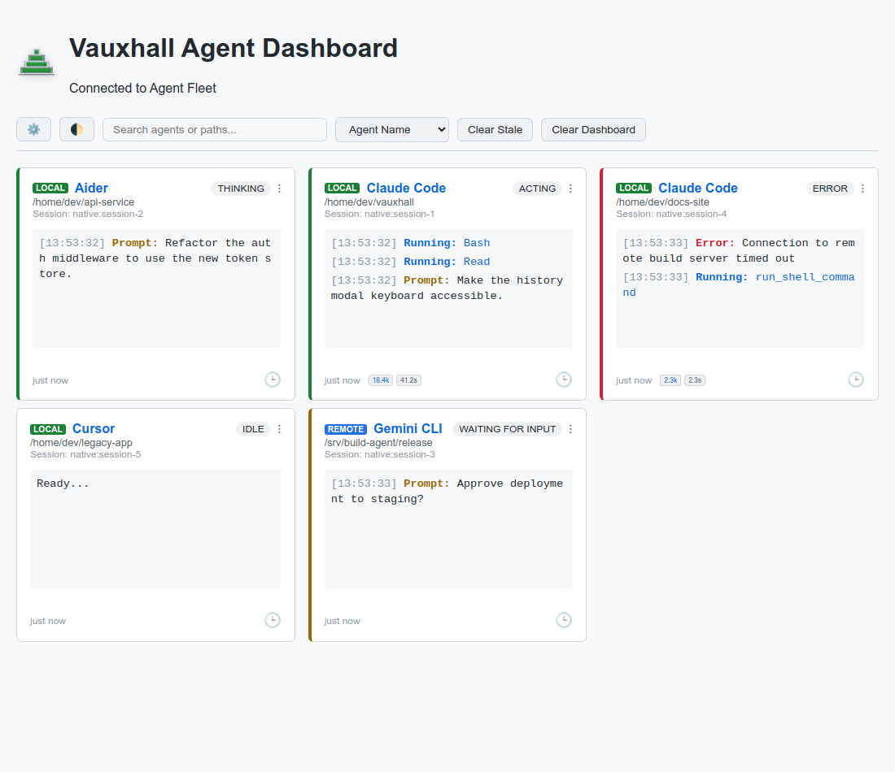
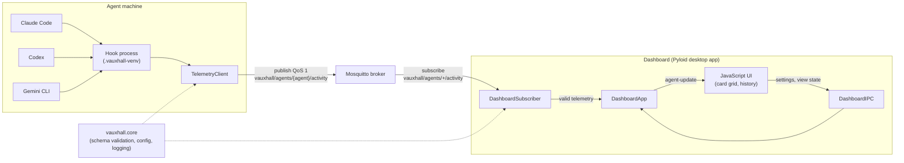
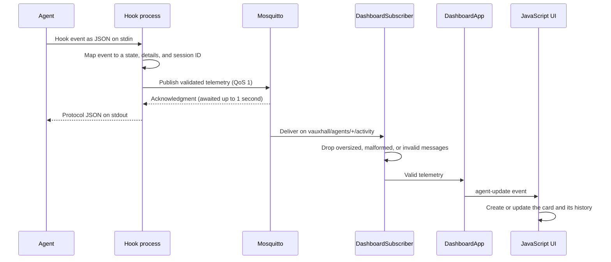

<p align="center">
  <a href="https://github.com/ipapadop/vauxhall">
    
  </a>
</p>

# Vauxhall Agent Dashboard

Vauxhall is a desktop dashboard that shows what your coding agents are doing.
It has built-in hooks for Claude Code, Codex, and Gemini CLI, and any other
agent can report to it through a small Python client or plain MQTT. The hooks
publish telemetry to an MQTT broker, and the dashboard shows each agent
session as a card in a grid.

> [!IMPORTANT]
> Vauxhall is **alpha** software. Interfaces can change between minor
> releases, the MQTT connection has no authentication or encryption yet, and
> the hooks publish prompts and commands. Read
> [Known limitations](#known-limitations) and [docs/privacy.md](docs/privacy.md)
> before using it with sensitive work.

<p align="center">
  
</p>

## Features

- **Live state**: Cards are color-coded by state: Acting, Thinking, Waiting for
  Input, Input Required, Error, or Idle.
- **Session-aware cards**: Cards are keyed by agent, workspace, and session ID,
  so concurrent sessions in one workspace stay separate. Up to 100 cards are
  kept by default; a new session evicts the least recently seen card.
- **Activity log**: Each card shows its last 5 events, including agent messages,
  with `[HH:mm:ss]`
  timestamps, token and duration badges for the latest operation, and a LOCAL
  or REMOTE badge.
- **History**: The 🕒 icon opens a resizable modal with the card's last 20
  events. It updates live, can be filtered, and pauses auto-scroll while you
  hover.
- **Search and sort**: Filter cards by agent name or workspace path, and sort by
  name, recent activity, status, or latest token count.
- **Stale detection**: Cards show a "last seen" timer and turn gray after the
  stale threshold (120 seconds by default). **Clear Stale** removes them.
- **Copy workspace**: Clicking a card copies its raw workspace path; the
  workspace path on each card is also a button, so it works from the keyboard.
- **Per-agent menu**: A card's ⋮ button can hide that card until its agent's
  next event, or add the agent to a denylist saved in the dashboard
  configuration; a denylisted agent's telemetry is dropped and no card for it
  is shown, until it's removed from the settings dialog.
- **Keyboard and screen reader support**: Every control is a real button or a
  labeled form control, the history and settings modals are native dialogs that
  close on Escape and return focus to the control that opened them, the
  connection line is a live region, focus is always visible, and card movement
  stops when the system asks for reduced motion.
- **Settings**: The ⚙️ button opens a settings dialog that saves to
  `~/.config/vauxhall/`, applies most changes without a restart, and can also
  update the hooks configuration.
- **Remembered view**: The theme, sort order, history state filter, and window
  size, position, and maximized state are restored the next time the dashboard
  starts.
- **Claude Code, Codex, and Gemini CLI hooks**: Installers register hooks that
  report prompts, assistant messages, tool activity, permission waits, tool
  outcomes (completed, failed, cancelled, or result unavailable), and idle
  state. Tool results are never published. Messages are limited to 4,096
  characters per event; longer messages end with an ellipsis.
- **Safe handling**: Telemetry is validated and size-limited, rendered as text,
  and never turned into shell commands. Hooks always return valid protocol JSON,
  even when telemetry fails.

## First run

This path runs everything on one machine and ends with a test card on the
dashboard. It takes a few minutes, most of it downloading Qt.

**1. Install and start Mosquitto**, the MQTT broker, with its command-line
clients:

```bash
# macOS
brew install mosquitto && brew services start mosquitto
# Debian and Ubuntu (the package starts the broker as a service)
sudo apt install mosquitto mosquitto-clients
# Windows: run the installer from https://mosquitto.org/download/
```

Mosquitto 2 listens only on `localhost:1883` by default, which is what
Vauxhall expects. Keep it that way; see [docs/privacy.md](docs/privacy.md).

**2. Install Vauxhall** with [pipx](https://pipx.pypa.io/), which puts the
`vauxhall` and `vauxhall-hook-install` commands on your `PATH`:

```bash
pipx install "vauxhall[dashboard] @ git+https://github.com/ipapadop/vauxhall.git"
```

**3. Start the dashboard:**

```bash
vauxhall
```

The status line at the top shows `Connected to Agent Fleet` once it reaches
the broker.

**4. Send a test event** from another terminal:

```bash
mosquitto_pub -h localhost -q 1 -t vauxhall/agents/Hello/activity -m '{"schema_version": 1, "agent": "Hello", "workspace": "/tmp/hello", "session_id": "first-run", "state": "Thinking", "details": {"status": "It works"}}'
```

A green **Hello** card appears with `It works` in its activity log. On
Windows, save the JSON to `hello.json` and run
`mosquitto_pub -h localhost -q 1 -t vauxhall/agents/Hello/activity -f hello.json`
from the Mosquitto installation directory.

**5. Connect an agent.** In a project you work on with Claude Code, Codex, or
Gemini CLI, install the hooks for the agents you use and restart them:

```bash
cd /path/to/project
vauxhall-hook-install claude codex gemini
```

The installer creates `.vauxhall-venv` in the project; add it to
`.gitignore`. Codex also asks you to trust the new hooks: open `/hooks` in
Codex. Start a session and its card appears on the dashboard.

If a step doesn't work, see [docs/troubleshooting.md](docs/troubleshooting.md).

## Installation

Vauxhall is installed from GitHub for now; it isn't on PyPI yet. Every install
command below needs Git. To install a release or another branch, tag, or
commit, add `@<ref>` to the URL, for example
`git+https://github.com/ipapadop/vauxhall.git@v0.1.0`.

| Machine | Install |
| --- | --- |
| Dashboard | `pipx install "vauxhall[dashboard] @ git+https://github.com/ipapadop/vauxhall.git"` |
| Agents only | `pipx install "vauxhall[hooks] @ git+https://github.com/ipapadop/vauxhall.git"` |

The `hooks` extra installs only `paho-mqtt`. Without pipx, install either one
with `pip` into a virtual environment of your own. From a clone, run
`pip install ".[dashboard]"` or `pip install ".[hooks]"`. Each GitHub release
also carries a wheel and a source archive, with a `SHA256SUMS` file to check
them.

**The dashboard's download is large.** The desktop window runs on Qt through
PySide6, a download of about 260 MB on Linux and Windows and 450 MB on macOS,
and about 670 MB once installed. Machines that only run agents need just the
`hooks` extra, which is under 1 MB.

## Compatibility

Requirements:

- Python 3.10, 3.11, 3.12, or 3.13
- An MQTT broker, such as [Mosquitto](https://mosquitto.org/) 2

| | Dashboard | Hooks |
| --- | --- | --- |
| Python | 3.10 - 3.13 | 3.10 - 3.13 |
| Linux | glibc 2.28+ on x86-64, glibc 2.39+ on ARM64 | any |
| macOS | 12 or newer, Intel or Apple silicon | any |
| Windows | 10 or newer, x86-64 or ARM64 | any |

The hooks depend only on `paho-mqtt`, which is pure Python, so they run
anywhere a supported Python does. The dashboard's reach is narrower because
`pyloid` pins `pyside6==6.9.2`, which ships binary wheels only for the
platforms above. CI runs the full test suite on every supported Python version
on Linux and on Python 3.13 on macOS and Windows, and starts the packaged
dashboard on all three.

| Agent | Integration | Settings file written | Needs |
| --- | --- | --- | --- |
| Claude Code | Built in | `.claude/settings.local.json` | A release with command hooks, including `MessageDisplay`, `PostCompact`, and `StopFailure` |
| Codex | Built in | `.codex/hooks.json` | A release with the stable `hooks` feature, including `Interrupt` and `SubagentStart` |
| Gemini CLI | Built in | `.gemini/settings.json` | A release with hooks, including `AfterModel` and `PreCompress` |
| Anything else | `TelemetryClient` or raw MQTT | None | Python 3.10+, or any MQTT client |

The hooks follow each agent's documented hook format. An agent release
without one of the events still works, without that event's updates. The
release notes record the agent versions each Vauxhall release was checked
with.

## Usage

### Running the dashboard

Run `vauxhall`, or `uv run vauxhall` from a source checkout. Clicking a card
copies its workspace path; the ⚙️ button opens the settings dialog. See
[docs/configuration.md](docs/configuration.md) for every setting.

### Installing agent hooks

Run the installer from the agent's workspace, naming each agent to install:

```bash
# One agent
vauxhall-hook-install claude

# Several agents at once, sharing one hooks environment
vauxhall-hook-install claude codex gemini
```

The agents are `claude`, `codex`, and `gemini`; at least one is required.

The installer recreates `.vauxhall-venv` in the workspace and installs
Vauxhall into it from the same source as the running copy: the same Git
commit, local directory, or wheel file, or otherwise the matching PyPI
release. Agents named in one command share that environment, so it is built
once however many you install. It then registers hooks that run the installed
hook module, so the hooks don't run code from a source checkout. Before
changing an existing hook or settings file, the installer backs it up and
validates it. Every named agent's settings are validated before the
environment is built, so an invalid file leaves them all unchanged and exits
with an error. Reinstalling replaces only Vauxhall's own handlers and writes
each file atomically, preserving unrelated settings and hooks. For Claude Code
the installer writes `.claude/settings.local.json`; restart Claude Code or open
`/hooks` to apply the hooks. For Codex, open `/hooks` after installing to
review and trust the new project hooks.

Run the installer again to enable assistant messages in existing workspaces.
Claude Code and Gemini CLI report completed messages during a turn. Codex
reports its final reply from the `Stop` hook and reads interim commentary from
its local session record when a later hook runs. Codex interim messages are
best effort because the record format can change and writes may lag hook events.

See [docs/integrations.md](docs/integrations.md) for event mappings, manual
configuration, the telemetry schema, and integrating other agents.

### Monitoring agents on other machines

Keep the broker on the dashboard machine's loopback interface and forward it
to each agent machine over SSH. [docs/remote-deployment.md](docs/remote-deployment.md)
has the commands.

### Simulating agents

To try the dashboard without real agents, publish mock telemetry from a source
checkout:

```bash
uv run python scripts/simulate_agent.py -n 5 -t 20
```

- `-n`, `--num-agents`: Number of concurrent agents (default 1).
- `-t`, `--num-transitions`: Events per agent (default 5).

## Uninstalling

### Hooks

In each workspace where you installed hooks:

1. **Remove the handlers** from the agent's settings file:
   `.claude/settings.local.json`, `.codex/hooks.json`, or
   `.gemini/settings.json`. Delete every handler whose `command` ends with
   `-m vauxhall.hooks.<agent>.telemetry_hook`, then any matcher group or event
   left empty. On Windows, the installer's commands start with
   `powershell.exe -NoProfile -NonInteractive -EncodedCommand`. In
   `.gemini/settings.json`, also delete handlers named `vauxhall-...` that run
   `hooks/gemini/telemetry_hook.py`, left by earlier versions. If the
   installer created the file (no `.bak` next to it), you can delete the file
   instead. Codex's installer also added a top-level `"description"`, which you
   can delete.
2. **Remove the hook environment**: `rm -rf .vauxhall-venv`, or
   `Remove-Item -Recurse -Force .vauxhall-venv` in PowerShell. Do this after
   step 1; otherwise the agent reports a failing hook on every event.
3. **Restart the agent.** Delete the `.bak` backups once you no longer need
   them.

### Vauxhall

```bash
pipx uninstall vauxhall
rm -rf ~/.config/vauxhall   # settings and remembered view
```

Temporary files are in `vauxhall-*` directories in the system temporary
directory; see [docs/privacy.md](docs/privacy.md#on-disk).

## Privacy and security

The hooks publish your prompts, shell commands, assistant messages, tool names,
and workspace paths, and Gemini CLI's hook publishes the complete input of
every tool call. Anyone who can connect to the broker can read all of it.
Tool output is never published. The dashboard keeps telemetry in memory only.

- Use the unauthenticated `localhost:1883` default for local development only.
- Reach remote agents over SSH, as in
  [docs/remote-deployment.md](docs/remote-deployment.md); never expose the
  broker on a network.
- [docs/privacy.md](docs/privacy.md) lists every field each integration
  publishes, where data is kept, and how to limit it.

Report vulnerabilities through the repository's
[security advisories](https://github.com/ipapadop/vauxhall/security/advisories).

## Known limitations

- **Alpha**: while the version is `0.x`, a minor release can break
  compatibility; see the [versioning policy](docs/releasing.md#versioning-policy).
- **No MQTT authentication or TLS** (issue #3). Remote agents need an SSH
  tunnel.
- **No per-field privacy controls**, and the Gemini CLI hook publishes whole
  tool inputs (issue #3).
- **Not on PyPI yet**; install from GitHub.
- **No uninstall command**; hooks are removed by hand, as above.
- **Agent gaps**: Claude Code has no interrupt event and hooks don't see token
  counts; Codex doesn't report Bash exit codes to hooks, so those calls show
  `result unavailable`, and its interim messages are best effort; Gemini CLI
  can't tell identical overlapping tool calls apart, so their durations may
  be swapped. See [docs/integrations.md](docs/integrations.md).
- **LOCAL/REMOTE badge**: hooks don't send `env`, so the badge is guessed from
  the workspace path, and remote workspaces under `/home` show LOCAL.
- **Nothing is stored**: a card's history holds 20 events and is lost when the
  dashboard exits.
- **Dashboard platforms** are limited to those PySide6 6.9.2 supports, and Qt
  is a large download.

## Documentation

| Document | Contents |
| --- | --- |
| [docs/integrations.md](docs/integrations.md) | Telemetry schema, states, each agent's event mapping and manual setup, and publishing from other agents |
| [docs/configuration.md](docs/configuration.md) | Configuration files, environment variables, precedence, defaults, and the settings dialog |
| [docs/privacy.md](docs/privacy.md) | Every field collected, retention, and broker exposure |
| [docs/remote-deployment.md](docs/remote-deployment.md) | Monitoring agents on other machines over SSH |
| [docs/troubleshooting.md](docs/troubleshooting.md) | Broker, dashboard, hook, and trust problems |
| [docs/releasing.md](docs/releasing.md) | Versioning and compatibility policy, and the release process |
| [CHANGELOG.md](CHANGELOG.md) | Changes in each release |
| [AGENTS.md](AGENTS.md) | Dashboard behavior contract and rules for contributors |

## Architecture

1. **Hooks (producers)**: Python modules run by agent hook events publish
   telemetry to an MQTT broker.
2. **Mosquitto (broker)**: Routes telemetry from hooks to the dashboard.
3. **Dashboard (consumer)**: A Pyloid desktop app with a Python MQTT backend and
   a vanilla JavaScript frontend.



Both sides share `vauxhall.core`, so hooks and the dashboard validate the same
schema and read configuration the same way.

## Information Flow



1. **The agent runs a hook.** On each event the agent runs the registered
   command from the workspace's `.vauxhall-venv` and writes the event to its
   stdin.
2. **The hook builds telemetry.** It maps the event to a state (`Acting`,
   `Thinking`, `Waiting for Input`, `Error`, or `Idle`) and details such as
   `tool`, `cmd`, `prompt`, `message`, `status`, `tokens`, and `duration`, and
   resolves the session ID from the agent's own session ID, a hash of the
   transcript path, or `VAUXHALL_SESSION_ID`. Without a session ID the event is
   skipped.
3. **The client publishes it.** `TelemetryClient` validates the payload against
   schema version 1, publishes it at QoS 1 to
   `vauxhall/agents/<agent_name>/activity`, and waits up to one second for the
   broker's acknowledgment. The hook always writes valid protocol JSON on
   stdout, even when telemetry fails, so the agent is never blocked.
4. **The broker routes it.** Mosquitto delivers the message to the dashboard,
   which subscribes to `vauxhall/agents/+/activity`.
5. **The subscriber filters it.** `DashboardSubscriber` drops messages larger
   than `max_payload_bytes`, then those that fail JSON decoding or validation,
   and logs each drop without payload values.
6. **The backend dispatches it.** `DashboardApp` forwards the event to the
   window. Until the frontend signals readiness, events are queued, keeping the
   newest `pending_update_limit` of them; the queue is drained in order when the
   frontend becomes ready.
7. **The frontend renders it.** The UI keys the card by agent, workspace, and
   session ID, creates it if needed (evicting the least recently seen card at
   `max_active_agents`), then updates its state color, activity log, metric
   badges, last-seen timer, and open history modal, and re-applies the current
   search and sort.

Information also flows the other way, from the UI to the backend over
`DashboardIPC`: reading settings and view state, saving them, and copying a
workspace path. Saved settings that change the broker restart the subscriber,
and the backend pushes the new stale threshold and card limit back to the UI.

## Project Structure

- `vauxhall/core/`: Configuration, logging, and telemetry validation shared by
  the dashboard and hooks.
- `vauxhall/dashboard/`: The Pyloid dashboard and its JavaScript UI.
- `vauxhall/hooks/`: The telemetry client, shared hook helpers, and the Claude
  Code, Codex, and Gemini CLI hooks and installers.
- `docs/`: User documentation and the dashboard screenshot shown above.
- `scripts/`: The agent simulator and a logging color check.
- `scripts/release_notes.py`: The release workflow's tag and changelog check.
- `tests/`: Python tests mirroring the `vauxhall/` package layout, with
  frontend tests in `tests/dashboard/ui/`.

## Development

Follow the [development rules](AGENTS.md#development-and-maintenance-rules):

- **Setup**: Install [uv](https://docs.astral.sh/uv/) and run
  `uv sync --locked`. It creates `.venv` with the exact versions in `uv.lock`,
  the same environment CI uses. After changing dependencies in
  `pyproject.toml`, run `uv lock` and commit `uv.lock`.
- **Python**: Run `ruff format .` and `ruff check .` with the pinned Ruff
  version, then `.venv/bin/pytest`. The packaged dashboard startup test is
  deselected by default because it downloads Qt; run it with
  `.venv/bin/pytest -m packaged`.
- **Frontend**: With Node.js 20.19 or newer, run `npm ci` once, then
  `npm test`.
- **Accessibility**: Dashboard changes must keep the
  [accessibility contract](AGENTS.md#dashboard-behavior): real buttons, accessible names,
  `<dialog>` modals, live regions, and reduced-motion support, covered by
  `tests/dashboard/ui/accessibility.test.js`.
- **Coverage**: `.venv/bin/pytest --cov` and, on Node.js 22.8 or newer,
  `npm run test:coverage` check the floors CI enforces. Raise a floor when
  coverage rises rather than lowering it to make a change pass.
- **Packaging**: After changing metadata, entry points, or bundled assets, run
  `python -m build` and `twine check dist/*`. The sdist is a complete source
  artifact: a new top-level file the tests or build need goes in
  `MANIFEST.in`.
- **Changelog and releases**: Add user-visible changes under
  `## [Unreleased]` in [CHANGELOG.md](CHANGELOG.md). Pushing a `v*` tag runs
  the release workflow; see [docs/releasing.md](docs/releasing.md).

## License

MIT
